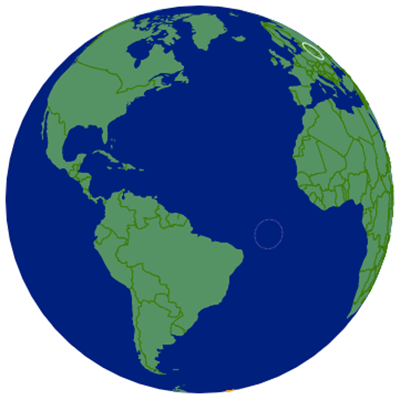

[](http://www.repostatus.org/#wip)
[](https://travis-ci.org/jonmcalder/planetary)
[](https://codecov.io/gh/jonmcalder/planetary)
 
---
 
```{r, echo = FALSE}
description <- readLines("DESCRIPTION")
rvers <- stringr::str_match(grep("R \\(", description, value = TRUE), "[0-9]{1,4}\\.[0-9]{1,4}\\.[0-9]{1,4}")[1,1]
```
[](https://cran.r-project.org/)
[](https://cran.r-project.org/package=planetary)
```{r, echo = FALSE}
description <- readLines("DESCRIPTION")
version <- gsub(" ", "", gsub("Version:", "", grep("Version:", description, value = TRUE)))
```
[](commits/master)
 
---
 
[)`-yellowgreen.svg)](/commits/master)

<!-- README.md is generated from README.Rmd. Please edit that file -->

```{r, echo = FALSE}
knitr::opts_chunk$set(
  collapse = TRUE,
  comment = "#>",
  fig.path = "README-"
)
```

# planetary

```{r echo = FALSE, message = FALSE}
badgecreatr::badgeplacer(status = "wip" , githubaccount = "jonmcalder", 
                         githubrepo = "planetary")
```

planetary is an htmlwidget for the `planetary.js` library, which facilitates the creation of "awesome interactive globes for the web". Check out http://planetaryjs.com/ for more info.




## Installation

You can install planetary from GitHub with:

```{r gh-installation, eval = FALSE}
# install.packages("devtools")
devtools::install_github("jonmcalder/planetary")
```

## Examples

Simple rotating planet example with random pings - also draggable and zoomable.

```{r example, eval=FALSE}
library(planetary)
planetary(rotate = 10)
```
