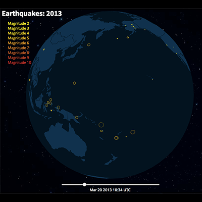

[](http://www.repostatus.org/#wip) [](https://travis-ci.org/jonmcalder/planetary) [](https://codecov.io/gh/jonmcalder/planetary)

------------------------------------------------------------------------

[](https://cran.r-project.org/) [](https://cran.r-project.org/package=planetary)

[](commits/master)

------------------------------------------------------------------------

[](/commits/master)

<!-- README.md is generated from README.Rmd. Please edit that file -->
planetary
=========

planetary is an htmlwidget for the `planetary.js` library, which facilitates the creation of "awesome interactive globes for the web". Check out <http://planetaryjs.com/> for more info.

 

Installation
------------

You can install planetary from GitHub with:

``` r
# install.packages("devtools")
devtools::install_github("jonmcalder/planetary")
```

Examples
--------

Simple rotating planet example with random pings - also draggable and zoomable.

``` r
library(planetary)
planetary(rotate = 10)
```
